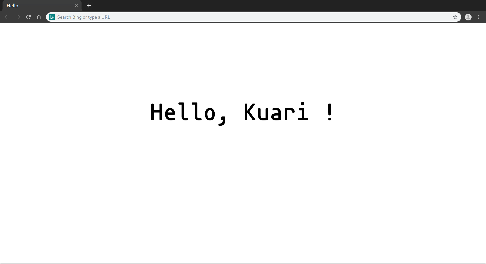

## Simple Tab

### Introduction

Just feel that the function of some tab page plugins is not what I need or even take up resources, so simply write a simple one, it is extremely simple.

### ScreenShot

